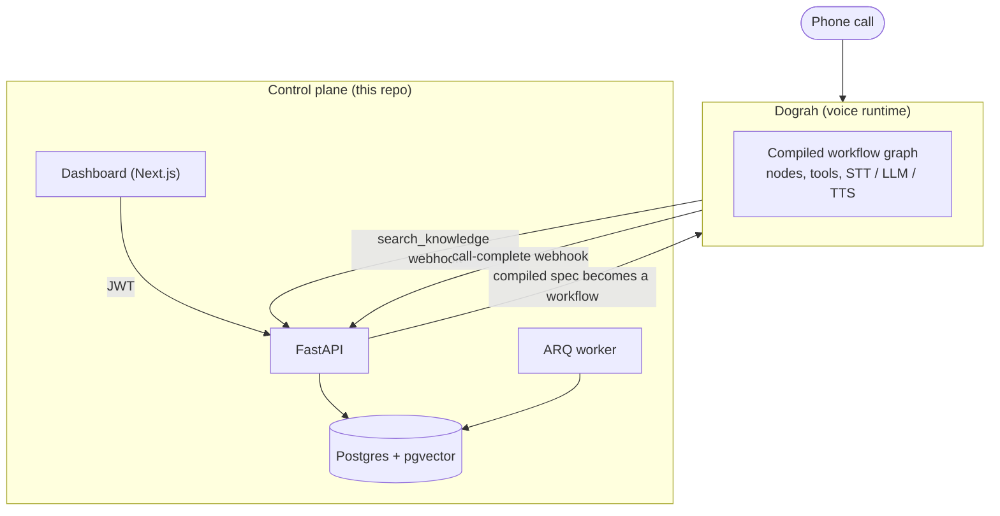

# Voice Agent Platform

*A control plane for turning "we just signed a client" into "their phone is answered by an AI" — same day, not next sprint.*

A dental clinic in Pune signs with your agency on Monday morning. By Monday evening, their phone is answered by an agent that understands Hindi and English mixed mid-sentence, knows their price list because you uploaded it as a PDF an hour earlier, books appointments into their calendar, and knows the exact moment to stop being a receptionist and patch a caller through to a human — because someone described a dental emergency, not a cleaning.

That turnaround is the actual product. Everything below is built against it: a new client on an existing vertical (Receptionist, Sales, Support, Booking, Lead Qualification) should be live in minutes of operator time, and a genuinely new vertical should be a scaffolded draft to edit, not a blank file.

This repo is the **control plane** — tenants, businesses, agent versions, knowledge, policies, tools, credentials, campaigns. It doesn't run the voice pipeline itself; it composes an agent and hands the finished spec to [Dograh](https://github.com/dograh-hq/dograh), an open-source voice AI runtime, over plain HTTP.

## The shape of an agent

Every agent this platform produces is the same equation, filled in differently per client:

```
  Template            (the role: Receptionist, Sales, Support, Booking, Lead Qualification)
+ Vertical Pack        (the industry overlay: dental, salon, real estate, ...)
+ Business             (this client: hours, location, services, transfer numbers)
+ Knowledge            (their documents — price lists, FAQs, policies — retrieved live, never pasted into the prompt)
+ Policies             (rules that are injected as instructions, never RAG'd: "emergencies escalate immediately")
+ Tools                (book_appointment, transfer_call, create_lead, search_knowledge, ...)
+ Voice                (persona, backchannel, interruption sensitivity, language mix, provider stack)
────────────────────────────────────────────────────────────────────────────
= a compiled spec, published as a Dograh workflow, bound to a phone number
```

`agent_compiler.py` is the only place this equation is evaluated, and its output is intentionally runtime-neutral — nothing Dograh-specific leaks past it. Swapping the voice runtime later means writing one new adapter, not touching tenant, agent, or knowledge models.

## What it sounds like

A live call against the dental vertical pack, running the default India stack (Sarvam STT/TTS, Gemini Flash, Exotel):

```
Caller:   Haan hi, mujhe ek appointment chahiye tha... cleaning ke liye.
Agent:    Bilkul! Cleaning appointment ke liye — aap kal ya parso mein se
          konsa din prefer karenge?
Caller:   Actually wait, mera tooth bahut zyada pain kar raha hai, bleeding
          bhi ho rahi hai thodi.
Agent:    Okay, that sounds urgent — I'm connecting you to our emergency
          line right now, please stay on the line.
                                                [ transfer_call → emergency ]
```

Two things happen in that exchange that aren't scripted: the code-switch from Hindi-English into English is handled naturally because it's a config axis (`languages: [hi, en]`), not a hardcoded flow — and the moment "pain" and "bleeding" show up, the escalation `Policy` fires and routes to the *emergency* number, not the standard front-desk transfer, because that distinction was written once in a vertical pack and applies to every clinic using it.

## Architecture



**Dograh is vendored as a git submodule at `runtime/dograh`, and it is never imported or deployed by this codebase.** It's there purely as a dev-time schema reference — when `services/dograh_client.py` needs to know the exact shape of a workflow node or a tool payload, we read Dograh's source instead of guessing at its API docs. At runtime the two systems only ever speak HTTP, as two separate services that could just as easily run on different hosts.

That boundary was a deliberate design decision, not a default. Dograh turns out to already be a fairly complete multi-tenant platform on its own — organizations, knowledge bases, tool CRUD, campaign dialing, workflow publishing. The obvious move is to lean on that instead of rebuilding it. But two of its features — document processing and service-key issuance — are unconditionally delegated to Dograh's own *hosted* backend (MPS), even in "self-hosted" mode. That's a third party in the loop for exactly the two things that matter most here: a client's documents, and the credential that authenticates every call. So the integration splits down the middle:

| Delegated to Dograh | Kept fully local |
|---|---|
| Workflow graph execution, STT/LLM/TTS pipeline | Knowledge ingestion, chunking, embeddings, pgvector search |
| Tool registration & MCP testing | Tenant → Dograh auth (`/auth/signup` + `/auth/login`, not the MPS-backed service-key endpoint) |
| Outbound campaign dialing, retries, concurrency | Tenant/business/agent modeling, credential storage (Fernet-encrypted) |

A tenant maps to one Dograh organization, provisioned by signing up a synthetic user on its behalf the first time it's needed — no hosted service ever sees a client's documents or holds the credential that speaks for a tenant.

## What's real right now

This isn't a mockup — every row marked *live* has run against an actual local Dograh instance, not just unit tests against its source.

| Area | Status |
|---|---|
| Tenancy, JWT auth, BYOC/BYOK credential storage | Built |
| Templates + vertical packs (5 roles, 1 India vertical pack seeded) | Built |
| Agent draft → compile → publish, versioned | Built, live |
| Knowledge ingestion → pgvector retrieval mid-call | Built, live |
| Policies (injected rules, escalation targets) | Built, live |
| Tools (built-in + generic webhook), synced to Dograh | Built, live |
| Outbound campaigns (create/launch/pause/resume/progress) | Built, live, idempotent on retry |
| Dashboard (businesses, agents, credentials, wizards) | Built |
| Telephony binding (Plivo/Exotel credential → Dograh org config → number → `inbound_workflow_id`) | Built — a real inbound call hasn't rung yet, since that needs a KYC-cleared local number the platform doesn't have; see [Telephony binding](#telephony-binding) |
| `Call.direction` / `campaign_lead_id` | Built, live — resolved from Dograh's own campaign-run context, not guessed |
| Composite onboarding (`POST /api/v1/onboard`) | Built, live — business through published agent in one call |
| Analytics (volume, outcome/status breakdown, duration + latency percentiles) | Built, live |
| Production Docker packaging | Built, live — see [Running in Docker](#running-in-docker) |

## Repository layout

```
voice-agent-platform/
├── control-plane/            # FastAPI backend — the actual product
│   ├── app/
│   │   ├── api/v1/             # REST routers — see API surface below
│   │   ├── core/                # config, db session, JWT, Fernet crypto
│   │   ├── models/                # SQLAlchemy models
│   │   ├── providers/               # runtime-neutral abstraction
│   │   │   └── adapters/dograh.py     # the only place that speaks Dograh's shapes
│   │   ├── schemas/                    # Pydantic request/response models
│   │   ├── services/                     # agent_compiler, dograh_client, search, campaign_csv
│   │   ├── workers/                        # ARQ worker + background jobs
│   │   └── alembic/                          # migrations
│   ├── tests/
│   └── Dockerfile
├── dashboard/                  # Next.js operator UI
├── templates/                    # generic role templates (5 YAML files)
│   └── verticals/                  # industry overlays on top of a template
├── scripts/                          # seed_templates.py, scaffold_vertical.py
├── deploy/                             # docker-compose.yml for this repo's own stack
└── runtime/dograh/                       # git submodule — schema reference only, never deployed
```

## Getting started

**Prerequisites:** Python 3.11+, [`uv`](https://docs.astral.sh/uv/), Node 20+, Docker, git.

```bash
git clone --recurse-submodules https://github.com/Kavin-bm/voice-agent-platform
cd voice-agent-platform
```

**1. Infrastructure** — Postgres (with pgvector), Redis, MinIO:

```bash
cd deploy && docker compose up -d postgres redis minio && cd ..
```

**2. Control plane:**

```bash
cd control-plane
uv sync
cp .env.example .env
```

Fill in the four `change-me` values in `.env` — `JWT_SECRET` and `INTERNAL_TOOL_SECRET`/`DOGRAH_WEBHOOK_SECRET` can be any random string, `CREDENTIAL_ENCRYPTION_KEY` needs a real Fernet key:

```bash
python -c "from cryptography.fernet import Fernet; print(Fernet.generate_key().decode())"
```

Then migrate, seed the templates, and run the API:

```bash
uv run alembic upgrade head
uv run python ../scripts/seed_templates.py
uv run uvicorn app.main:app --reload
```

The API is now up at `http://localhost:8000` (interactive docs at `/docs`).

**3. Dashboard:**

```bash
cd ../dashboard
npm install
npm run dev
```

Open `http://localhost:3000`. The first login needs a tenant — create one with the platform admin key (from `.env`, `PLATFORM_ADMIN_API_KEY`):

```bash
curl -X POST http://localhost:8000/api/v1/tenants \
  -H "X-Admin-Key: <your PLATFORM_ADMIN_API_KEY>" \
  -H "Content-Type: application/json" \
  -d '{"name": "Acme Dental", "slug": "acme-dental", "owner_email": "owner@acme.test", "owner_password": "change-me"}'
```

Log into the dashboard with `owner_email` / `owner_password` from there.

## Running Dograh locally

`runtime/dograh` is already checked out as a submodule (that's what `--recurse-submodules` did above). It has its own `docker-compose.yaml` and brings up its own Postgres/Redis/MinIO — which collide on ports with the stack above if you run both on one machine. A local override drops the internal ports and remaps the ones that need to stay host-reachable:

```yaml
# runtime/dograh/docker-compose.override.yml (local-only, not committed upstream)
services:
  postgres:
    ports: !override []
  redis:
    ports: !override []
  minio:
    ports: !override
      - "127.0.0.1:19000:9000"
      - "127.0.0.1:19001:9001"
  api:
    ports: !override
      - "18080:8000"
```

Compose *appends* list-valued keys like `ports` on override merge, so a plain re-declaration doesn't drop the base mapping — `!override` is required to actually replace it. MinIO keeps a host port on purpose: presigned upload/download URLs for documents and campaign CSVs are signed against `MINIO_PUBLIC_ENDPOINT` and handed to whoever is on the other end of the HTTP call, which is this control plane, running outside Dograh's Docker network.

Bring it up, then point this repo's `.env` at it:

```bash
cd runtime/dograh && docker compose up -d
```

```bash
DOGRAH_BASE_URL=http://localhost:18080          # if control-plane runs on the host (uv run uvicorn)
# DOGRAH_BASE_URL=http://host.docker.internal:18080   # if control-plane runs inside deploy/docker-compose.yml instead
DOGRAH_CALLBACK_BASE_URL=http://host.docker.internal:8000   # correct in both cases — Dograh's container reaches the host this way
```

The asymmetry is real, not a typo: `DOGRAH_BASE_URL` is how *we* reach Dograh, `DOGRAH_CALLBACK_BASE_URL` is how *Dograh's container* reaches us — and a container's route back to the host is never the same address the host uses for itself.

## Running in Docker

The dev setup above runs the control plane directly on the host so `--reload` works; `deploy/docker-compose.yml` also builds and runs it as containers, for something closer to how this would actually deploy. It reads its secrets from `deploy/.env`, a separate file from `control-plane/.env`:

```bash
cd deploy
cp .env.example .env   # same secrets as control-plane/.env if you want the two to share a database
docker compose up -d --build
```

`control-plane-api` runs `alembic upgrade head` before `uvicorn` on every start, and `control-plane-worker` runs the ARQ worker — both against the same `postgres`/`redis`/`minio` services in this same compose file. If Dograh is also running locally (previous section), point `DOGRAH_BASE_URL` at `http://host.docker.internal:18080` here instead of `localhost` — from inside a container, `localhost` means the container, not the host.

## Composing an agent

The fast path is one call:

```bash
POST /api/v1/onboard
{
  "business_name": "Smile Bright Dental",
  "structured_config": {"hours": "9am-7pm", "city": "Pune"},
  "default_transfer_number": "+919800000000",
  "template_id": "<receptionist template id>",
  "vertical_pack_id": "<dental india pack id>",
  "agent_name": "Smile Bright Receptionist",
  "policies": [{"category": "hours", "rule_text": "Never book outside 9am-7pm."}],
  "knowledge_document_urls": ["https://example.com/price-list.pdf"],
  "publish": true
}
```

→ returns `business_id`, `agent_id`, `agent_version_id`, and `dograh_workflow_id` once the whole chain — business, agent, draft version, policies, knowledge, compile, publish — has actually succeeded. Pass a `phone_number` object (`number`, `provider`, `country_code`) too and it binds the number in the same call (see [Telephony binding](#telephony-binding) below for what that needs first).

`onboarding.py` doesn't re-derive any of this — it calls the same endpoint functions listed below directly, so the composite path can never drift from what each step does on its own:

```
POST /api/v1/businesses                                      → business_id
POST /api/v1/agents            {business_id, template_id, vertical_pack_id}  → agent_id
POST /api/v1/agents/{id}/versions                             → draft version_id (not created automatically by the line above)
POST /api/v1/knowledge-sources                                → knowledge_source_id
POST /api/v1/knowledge-sources/{id}/documents/upload           → ingestion runs on the ARQ worker
POST /api/v1/agents/{id}/versions/{v}/policies  (repeatable)   → escalation / handling rules beyond the vertical pack
POST /api/v1/agents/{id}/versions/{v}/compile                  → assembles the neutral spec
POST /api/v1/agents/{id}/versions/{v}/publish                  → pushes it to Dograh as a workflow
POST /api/v1/phone-numbers/{id}/bind            {version_id}    → live
```

Binding is what swaps `PhoneNumber.bound_agent_version_id`, and it's the whole rollback mechanism: publishing never deletes the previous version, so rolling back is just binding the number to it again.

### Telephony binding

Binding a number pushes the tenant's stored telephony credential to Dograh as an org-level configuration (once, cached on the credential row), then creates or updates the number there with `inbound_workflow_id` set — for Plivo specifically, Dograh also rewrites the Plivo Application's `answer_url` for you, so there's no manual step on Plivo's own console. This is live-verified against a running Dograh instance and confirmed against its actual telephony-provider source, not guessed.

What it hasn't done yet is ring: that needs a phone number, and Plivo (like every carrier serving India) requires KYC — business registration documents — to activate a local Indian DID, which this project doesn't have. A number on a provider that doesn't require it (e.g. a Plivo US/UK number, no code changes needed — `provider`/`country_code` are free values already) would prove the same path end to end; a real India-facing client number is a "when this is agency infrastructure, not a personal project" problem, not a code problem.

## Scaffolding a new vertical

An existing vertical (say, Receptionist + Dental) is fast because the pack already exists. A vertical nobody has built yet — a salon, a real estate brokerage — starts from a draft instead of a blank file:

```bash
cd control-plane
uv run python ../scripts/scaffold_vertical.py \
  --template receptionist --name salon \
  --brief "Hair/beauty salon: haircuts, coloring, walk-ins vs appointments"
```

This writes a starter YAML under `templates/verticals/` and stops — nothing is seeded into the database and nothing reaches a client until a human reads it, edits it, and runs `scripts/seed_templates.py`. It's a draft generator, not an autonomous one.

## API surface

All routes below are mounted under `/api/v1`, except `/internal/*` (Dograh-facing only — tool webhooks and the call-complete callback, not for the dashboard or any human client).

| Prefix | Covers |
|---|---|
| `/auth` | Login (JWT) |
| `/tenants` | Tenant creation — platform-admin only, no self-serve signup |
| `/credentials` | BYOC/BYOK provider credentials, encrypted at rest |
| `/businesses` | Per-client business records |
| `/templates` | Read-only: seeded role templates + their vertical packs |
| `/agents`, `/agents/{id}/versions/{v}/policies` | Agent + version lifecycle, policies |
| `/knowledge-sources`, `/documents` | Knowledge ingestion |
| `/phone-numbers` | Number registration + binding to a published version |
| `/calls` | Call, transcript, recording history |
| `/campaigns` | Outbound campaign create/launch/pause/resume/progress |
| `/onboard` | Composite business → published agent flow in one call |
| `/analytics` | Call volume, outcome/status breakdown, duration + latency percentiles |
| `/internal/tools`, `/internal/webhooks` | Dograh → control-plane only |

## Design notes

A few decisions worth knowing before extending this:

- **Tenant isolation is enforced at the query layer**, not the controller layer — every query filters by `tenant_id` sourced from the JWT via one shared dependency, so a missed check in a new endpoint can't silently leak another tenant's row.
- **BYOC/BYOK by default.** Each tenant supplies its own telephony/STT/LLM/TTS credentials. The platform doesn't resell minutes — a `UsageEvent` table already exists for metered billing later, though nothing writes to it yet.
- **Knowledge never leaves this infrastructure.** Parsing, chunking, and embeddings are our own pipeline against our own Postgres, specifically so a client's documents never transit a third-party hosted service.
- **Policies are never retrieved — they're injected.** The retrieval-vs-instruction split (`structured_config` = facts, `Policy` = rules, `Chunk` = retrieved knowledge) is a hard boundary in `agent_compiler.py`, not a convention someone could accidentally blur.
- **Campaign launch is idempotent.** A retry after a partial failure resumes instead of creating a duplicate campaign on Dograh's side — found by actually hitting that failure, not designed in speculatively.
- **Call direction is read, not assumed.** Dograh's campaign dispatcher sets `initial_context.direction="outbound"` and a top-level `campaign_id` on every campaign-dispatched run and nothing sets either for an inbound run — that absence is what `dograh_call_complete` keys off, confirmed against Dograh's source rather than inferred from behavior.

## Roadmap

1. **Prove a real inbound call end to end.** Blocked on a phone number — India-local DIDs need KYC (business registration) that this project doesn't have yet; a non-Indian Plivo number would prove the same code path today.
2. **Draft test-call API.** Dograh has a Trigger-node path for exactly this (`/api/v1/public/agent/test/<trigger_path>`), but it's documented as authenticating via `X-API-Key` — Dograh's MPS-backed service-key issuance, which this project deliberately avoids (see Architecture above). Whether that endpoint also accepts the bearer-JWT auth `dograh_client.py` uses everywhere else is unconfirmed; until then, exercising a draft means publishing it and calling in for real. Right now a draft is only checked by reading `compiled_spec`, not by hearing it.
3. **`Call.first_response_latency_ms`.** Analytics reports its percentiles honestly (null / zero-sample) because nothing populates this field yet — needs Dograh's webhook context inspected for a real time-to-first-response signal, the same way `initial_context.direction` was confirmed for call direction rather than guessed.
